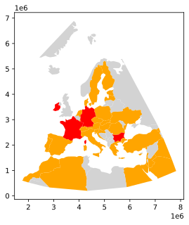

# P5: EDGAR Web Logs

In the US, public companies need to regularly file
various statements and reports to the SEC's (Securities and Exchange
Commission) EDGAR database.  EDGAR data is publicly available online;
furthermore, web requests to EDGAR from around the world are logged
and published.  EDGAR logs are huge.  Logs for *just one day* might be
about 250 MB compressed as a .zip (or 2 GB uncompressed!).

In this project, you'll create and turn in a single file, `main.py`.
It will be runnable as a command line tool for processing compressed
EDGAR web logs.  We'll provide with data from a subset of one day.

Your `main.py` will support four commands:

* `ip_check`: given one or more IP addresses, lookup the associated regions, and print the results
* `region`: copy a zipped file of requests, adding region info and sorting the output
* `zipcode`: dump out a list of zip codes appearing in the docs referenced in the web logs
* `geo`: create a map of countries in a given region, colored based on frequency of web requests to EDGAR

## Corrections/Clarifications

* changed `region.zip` to `server_log2.zip`
* added clarification to output of `check_ip`
* updated example in Part 3 to match given url
* fixed zipcode expected output
* Nov 16: read note about `.iloc` and `.loc` in FAQ, or your code may run too slowly
* Nov 20: in tester.py modified `temp.zip` to `server_log2.zip`

[Piazza FAQ Post](https://piazza.com/class/kskk56h2ohc7lg?cid=576)

## Packages

You'll need to install some packages:

```
pip3 install --upgrade pip
pip3 install geopandas shapely descartes geopy netaddr
sudo apt install -y python3-rtree
```

# Group Part (75%)

Be sure to run `python3 tester.py` regularly to estimate your grade. Additional printing other than the asked solution will cause the tester to give 0s, so please remove additional printing before you run `tester.py`. 

## Part 1: `ip_check`

Your program should have an `ip_check` command that takes one or more
IP addresses.  It should use the `ip2location.csv` (borrowed from
https://lite.ip2location.com/database/ip-country) to lookup what
country/region owns a particular IP address.  It should then print a json-formatted string.  The CSV file looks like
this:

```
low,high,code,region
0,16777215,-,-
16777216,16777471,US,United States of America
16777472,16778239,CN,China
16778240,16779263,AU,Australia
16779264,16781311,CN,China
...
```

The first two numbers are IP ranges (inclusive on both ends).  For example, the IP
address 16777473 belongs to China because it is between 16777472 and
16778239.

IP addresses are more commonly represented as four-part numbers, like
"34.67.75.25".  To convert an address like this to an integer, you can
use the following:

```python
import netaddr
int(netaddr.IPAddress("34.67.75.25"))
```

You also need to use `time.time()` calls before and after to measure the time it takes for your code to lookup the region for an IP address.

Say somebody runs your program like this, with four IP addresses:

```
python3 main.py ip_check 1.1.1.1 1.1.1.2 9.9.9.9 1.1.1.2
```

You might have some code like this in your `.py` to identify which
command should run and pull in the relevant command line data (be sure
to read about `sys.argv` if you need a refresher on how it works).

```python
import sys

def main():
    if len(sys.argv) < 2:
        print("usage: main.py <command> args...")
    elif sys.argv[1] == "ip_check":
        ips = sys.argv[2:]
        # TODO: call function(s) you write to do IP checking
    # TODO: other commands
    else:
        print("unknown command: "+sys.argv[1])

if __name__ == '__main__':
     main()
```

Your printed output should be a JSON-formatted list of four dicts
(corresponding to those four IP addresses):

```
[
  {
    "ip": "1.1.1.1",
    "int_ip": 16843009,
    "region": "United States of America",
    "ms": 5.023002624511719
  },
  {
    "ip": "1.1.1.2",
    "int_ip": 16843010,
    "region": "United States of America",
    "ms": 0.04100799560546875
  },
  {
    "ip": "9.9.9.9",
    "int_ip": 151587081,
    "region": "United States of America",
    "ms": 11.50202751159668
  },
  {
    "ip": "1.1.1.2",
    "int_ip": 16843010,
    "region": "United States of America",
    "ms": 11.83176040649414
  }
]
```

In addition to giving ip, integer value of ip, and the region, it should give how many milliseconds
each lookup took.  Look at the measurements above: it took 5.02 ms to
lookup 1.1.1.1, but it only took 0.04 ms to lookup 1.1.1.2.

You aren't expected to have identical times, but you should optimize
your code so that consecutively looking up multiple IP addresses in
the same range, or nearby ranges, is fast (certainly don't loop over
every range every time).  Notice, however, that the second lookup of
1.1.1.2 is slow, even though it was looked up previously; this is fine
because it is not near the immediately preceding IP of 9.9.9.9.

The reason you need to optimize this is that the next command will
need to look up countries/regions for a large number of IP addresses that are
in sorted order, and it will be quite slow overall if you can't do
similar consecutive lookups efficiently.

**Hint:** a slow way to find IP address would be loop over all the
  indexes corresponding to rows of the `ip2location.csv` file (0, 1,
  2, ..., N-1) each time another IP is looked up.  An alternative is
  to keep track of the index (as a global variable) of the row in the
  CSV that matches the previous IP that was looked up.  Say the
  previous IP corresponded to row 1020, and the current IP being
  looked up corresponds to row 2025.  Then you could loop over fewer
  indexes (1020, 1021, 1022, 1023, 1024, 1025).  This is possible
  because `ip2location.csv` is already sorted for you.  Of course,
  sometimes the IP being looked up will be smaller than the previous
  one, and you will have to loop downward (1025, 1024, 1023, ...).

## Part 2: `region`

Take a look at the list of daily zips and CSV documentation on the EDGAR site:
* https://www.sec.gov/dera/data/edgar-log-file-data-set.html
* https://www.sec.gov/files/EDGAR_variables_FINAL.pdf

We have provided a `server_log.zip` file, which is a subset of the
records from `log20170101.zip`.  You'll be creating lots of zip files
for this projects, so you'll want to know some command line techniques
to troubleshoot.

View names of files in a zip file:

```
unzip -l server_log.zip
```

View the start of a file inside of a zip file (change "head" to "tail"
to see the end):

```
unzip -p server_log.zip rows.csv | head -n 5
```

The expected result is:

```
ip,date,time,zone,cik,accession,extention,code,size,idx,norefer,noagent,find,crawler,browser
104.197.32.ihd,2017-01-01,00:00:00,0.0,1111711.0,0001193125-12-324016,-index.htm,200.0,7627.0,1.0,0.0,0.0,10.0,0.0,
208.77.214.jeh,2017-01-01,00:00:00,0.0,789019.0,0001193125-06-031505,.txt,200.0,46327.0,0.0,0.0,0.0,10.0,0.0,
54.197.228.dbe,2017-01-01,00:00:00,0.0,800166.0,0001279569-16-003038,-index.htm,200.0,16414.0,1.0,0.0,0.0,10.0,0.0,
108.39.205.jga,2017-01-01,00:00:01,0.0,354950.0,0000950123-09-011236,-index.htm,200.0,8718.0,1.0,0.0,0.0,10.0,0.0,
```

Your `region` command will be run as follows to infer region based on IP address:

```
python3 main.py region server_log.zip server_log2.zip
```

There will be a `rows.csv` in `server_log2.zip` like the one in `server_logs.zip` with three differences:

1. the `ip` column will be converted to an int (use `netaddr` as
before).  Some digits are censored as random letters in the dataset.
Any such letters can be replaced with zeros for simplicity (for
example, `104.197.32.ihd` becomes `104.197.32.000`) prior to int conversion.
2. the rows will be sorted by the `ip` column, ascending.
3. a `region` column will be added, computed based on the IP, hopefully reusing code/function(s) you built for your `ip_check` command

We covered reading zip files on lab 3: https://github.com/cs320-wisc/f21/blob/main/lab3/part2.md

You can also write CSVs inside zip files like this:

```python
with ZipFile(????, "w", compression=ZIP_DEFLATED) as zf:
    with zf.open(????, "w") as f:
        df.to_csv(f, index=False)
```

Your `region` command should not take more than 30 seconds to run on
our testing machine.

## Part 3: `zipcode`

Looking at the `cik`, `accession`, and `extention` fields tells you what web resoure a user was requesting (in particular, each company has it's own `cik`):

```
ip,date,time,zone,cik,accession,extention,code,size,idx,norefer,noagent,find,crawler,browser,region
54.212.94.jcd,2017-01-01,03:31:36,0.0,1461219.0,0001209191-21-001287,-index.htm,301.0,243.0,1.0,0.0,1.0,10.0,0.0,,United States of America
...
```

For this row, we can construct the following URL from `1461219.0`, `0001209191-21-001287`, and `-index.htm`:

https://www.sec.gov/Archives/edgar/data/1461219/0001209191-21-001287-index.htm

We have already downloaded the docs for a subset of the requests to
`small.zip` for you and placed them in `docs.zip`.  Use **regular
expressions** to see how many zip codes for states NY, CA, WI, and IL
you can find in these files.  You need to find both the 5-digit zip
codes format (like `10003`) and the 5-dight zip codes plus 4-digit
add-on codes format (like `10017-2630`). Before doing the regex
searches, you should read the text of each file directly into a string
(even if the file ends with ".htm" or similar, don't use
BeautifulSoup).

Here is an example of an address in one of the files:

```
2525 DUPONT DR IRVINE CA 92612
```

Note that the format does not include a comma between state and zip.
You need to find both the 5-digit zip codes format (like `10003`) and
the 5-dight zip codes and 4-digit add-on codes format (like
`10017-2630`).

Before doing the regex searches, you should read the text of each file
directly into a string (even if the file ends with ".htm" or similar,
don't use BeautifulSoup).

The command is `python3 main.py zipcode docs.zip`.  Just print each
zip codes on its own line.  The order doesn't matter, but there
shouldn't be any duplicates.  Note 10003 and 10003-3019 are not
counted as duplicates:

```
10003
10003-3019
10004
10005
10007
10013
...
```

# Individual Part (25%)

## Part 4: `geo`

It should be possible to run `python3 main.py geo 3035
out.svg` to produce an image named "out.svg" that looks something
like this (check by downloading and opening it in your browser):



You can use the `naturalearth_lowres` shapefile that comes with
geopandas to create the map. `server_log2.zip` is created in part 2 by the region command. 
The color should be based on number of
occurences in `server_log2.zip` (0 is gray, 1-999 is orange, 1000+ is red). 
For simplicity, you can ignore rows in `server_log2.zip` where the country
name doesn't exactly match the names in `naturalearth_lowres`.

`3035` is the ID of an EPSG projection (your code should works with
others too, like 4036, 4144, 4248, and 4555).  You can look it up like
this:

```python
import pyproj
crs = pyproj.CRS.from_epsg(proj)
```

You should use `GeoDataFrame.to_crs` to use the projection with the
given ID.  You should also crop the map to that region only.  You can
find the projection window with things like `crs.area_of_use.west` for
the left side (and similar for other sides).

Note that geopandas has a bug
(https://github.com/geopandas/geopandas/pull/2224) that mixes up the
colors of polygons when some polygons are empty, as happens after
cropping an image.  Consider using `GeoDataFrame.is_empty` to filter
these out.

# Conclusion

The EDGAR logs are supposedly anonymized (with the last three docs
left), but we can still tell where the users live and what they're
looking at.  Others have used this same data to make good guesses
about what docs various hedge funds and others are looking at, then
correlate that with success.  For those interested in the nitty-gritty
details of what could be done with this data, take a look at this
early-stage work: [Hedge Funds and Public Information
Acquisition](https://papers.ssrn.com/sol3/papers.cfm?abstract_id=3127825).
