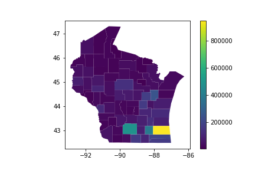
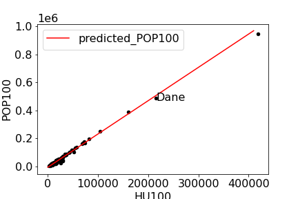
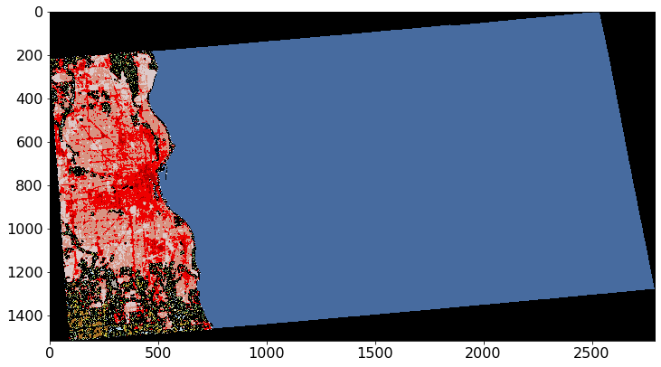

# Project 6: Regression Models

## Overview

We will be predicting population of counties in Wisconsin using regression models.  You'll need to extract data from three different datasets to construct DataFrames suitable for training:

* `counties.geojson` - population and boundaries of each county 
* `counties_tracts.db` - details about housing units per tract (counties are sub-divided into tracts)
* `land.zip` - details about land use (farm, forest, developed, etc.) in WI

# Group Part (75%)

For this portion of the project, you may collaborate with your group
members in any way (even looking at working code).  You may also seek
help from 320 staff (mentors, TAs, instructor).  You <b>may not</b>
seek receive help from other 320 students (outside your group) or
anybody outside the course.

## Model 1: Area to Population

### Q1: How many counties are in Wisconsin?

`counties.geojson` is probably the easiest dataset to start working with, but you could also determine this with a query to the `counties_tracts.db` if you prefer.

### Q2: What is the population of each county in WI?

Answer with a geopandas plot that has a legend.  The population is in the `POP100` column.



### Dataset 1

Let's construct a dataset we can use to train a model.  Read `counties.geojson` into a GeoDataFrame (if you haven't already done so).

Add a column to your GeoDataFrame specifying `AREALAND` for each county.  You can find this info in the `counties_tracts.db` database.  Hints:

* this has an example of how to connect to a DB: https://docs.python.org/3/library/sqlite3.html
* this has some examples of how to use `read_sql` on a DB connection to execute a query: https://pandas.pydata.org/docs/reference/api/pandas.read_sql.html
* a great first query for an unfamiliar DB is `pd.read_sql("""SELECT * FROM sqlite_master""", conn)`.  That will show you all the tables the DB has.
* try running `pd.read_sql("""SELECT * FROM ????""", conn)` for each table name to see what all the tables look like

After you've added `AREALAND` to your GeoDataFrame, use `train_test_split` to split the rows into `train` and `test` datasets.

By default, `train_test_split` randomly shuffles the data differently each time it runs.  Pass `random_state=320` as a parameter so that it shuffles the same way as it did for us (so that you get the answers the tester expects).

### Q3: What are the counties in the test dataset?

Answer with a list, in the same order as the names appear in the DataFrame.

### Q4: How much variance in the `POP100` can a `LinearRegression` model predict based only on `AREALAND`?

`fit` the model to your `train` dataset and `score` it on your `test` dataset.

### Q5: What is the expected population of a county with 500 square miles of area, according to the model?

Consult the Census documentation to learn what units the data is in, and do any conversions necessary to answer the question: https://tigerweb.geo.census.gov/tigerwebmain/TIGERweb_attribute_glossary.html

Assume there are exactly 2.59 kilometers per mile for the purposes of your calculation.

## Model 2: Housing Units to Population

### Dataset 2

Construct this dataset (split into train/test) the same way you constructed Dataset 1, but instead of `AREALAND`, have a `HU100` column that specifies housing units per county.

The query to get housing units per county is complicated!  County names are in the `counties` table and `HU100` values are in the `tracts` table.  Fortunately, both tables have a `COUNTY` column you can use to combine.  See lab for hints.

### Q6: What are the HU100 values for the counties in the train dataset?

Answer with a `dict`.

### Q7: How much variance in the `POP100` can a `LinearRegression` model predict based only on `HU100`?

Answer with the average of 5 scores produced by `cross_val_score` on the training data (https://scikit-learn.org/stable/modules/generated/sklearn.model_selection.cross_val_score.html).

### Q8: What is the standard deviation of the scores averaged in the previous question?

### Q9: What is the formula relating POP100 and HU100?

Fit your model to the entire training dataset to find the answer.  Round the coefficient and intercept to 2 decimal places.  Format the answer like this:

```
POP100 = ????*HU100 + ????
```

## Q10: what is the relationship between HU100 and POP100, visually?

Answer with plot showing a scatter of actual values (both train and test) and a fit line based on the model.

Use a `.text` call to annocate Dane County, as in the following.



## Model 3: Land Use to Population

### Q11: How many numbers in the matrix A is between 2 and 5 (inclusive)?

You can paste the following to define `A`:

```python
A = np.array([
    [0,0,5,8,4],
    [1,2,4,0,3],
    [2,4,0,9,2],
    [3,5,2,1,1],
    [0,5,0,1,0]
])
```

### Q12: How does Milwaukee County Look?

You can show the image like this:

```python
fig, ax = plt.subplots(figsize=(12,12))
ax.imshow(????, vmin=0, vmax=255)
```

You can get the matrix for Milwaukee County by learning how to use `rasterio` in the lab.

You could also define a custom color map (corresponding to the legend here: https://www.mrlc.gov/data/legends/national-land-cover-database-2019-nlcd2019-legend) and pass `cmap=custom_cmap` to `imshow` to use it.

You can created a custom color map using `ListedColormap`, which lets you specify red, green, blue mixes for different values.  Here's an example for the land use data:

```python
from matplotlib.colors import ListedColormap

c = np.zeros((256,3))
c[0] = [0.00000000000, 0.00000000000, 0.00000000000]
c[11] = [0.27843137255, 0.41960784314, 0.62745098039]
c[12] = [0.81960784314, 0.86666666667, 0.97647058824]
c[21] = [0.86666666667, 0.78823529412, 0.78823529412]
c[22] = [0.84705882353, 0.57647058824, 0.50980392157]
c[23] = [0.92941176471, 0.00000000000, 0.00000000000]
c[24] = [0.66666666667, 0.00000000000, 0.00000000000]
c[31] = [0.69803921569, 0.67843137255, 0.63921568628]
c[41] = [0.40784313726, 0.66666666667, 0.38823529412]
c[42] = [0.10980392157, 0.38823529412, 0.18823529412]
c[43] = [0.70980392157, 0.78823529412, 0.55686274510]
c[51] = [0.64705882353, 0.54901960784, 0.18823529412]
c[52] = [0.80000000000, 0.72941176471, 0.48627450980]
c[71] = [0.88627450980, 0.88627450980, 0.75686274510]
c[72] = [0.78823529412, 0.78823529412, 0.46666666667]
c[73] = [0.60000000000, 0.75686274510, 0.27843137255]
c[74] = [0.46666666667, 0.67843137255, 0.57647058824]
c[81] = [0.85882352941, 0.84705882353, 0.23921568628]
c[82] = [0.66666666667, 0.43921568628, 0.15686274510]
c[90] = [0.72941176471, 0.84705882353, 0.91764705882]
c[95] = [0.43921568628, 0.63921568628, 0.72941176471]
custom_cmap = ListedColormap(c)
```



### Q13: What portion of Milwaukee County is "Open Water"?

Be careful!  Not everything in the matrix is Milwaukee County -- be sure not to count the cells with value 0.

### Dataset 3

Create a DataFrame called `land_df` where the index contains county names (in the same order they appear in `counties.geojson`) and four columns:

* developed_open
* developed_low
* developed_med
* developed_high
* POP100

The first four columns correspond to land cover codes 21-24 (https://www.mrlc.gov/data/legends/national-land-cover-database-2019-nlcd2019-legend) and should give the number of pixels in a county of the specified type.  The 5th column should get pulled in from `counties.geojson`.

Split `land_df` using train_test_split with `random_state=320` (as with the other datasets).

### Q14: What are the First 3 Columns of `train`, represented as nested dictionaries?

You can use `train.iloc[:3].to_dict()` to answer.

### Q15: What is the Relationship Between POP100 and ________________?

Plot a scatter with `POP100` on the y-axis and one of the development columns of your choosing on the x-axis.

# Individual Part (25%)

You have to do the remainder of this project on your own.  Do not
discuss with anybody except 320 staff (mentors, TAs, instructor).

Individual part will be released soon!

